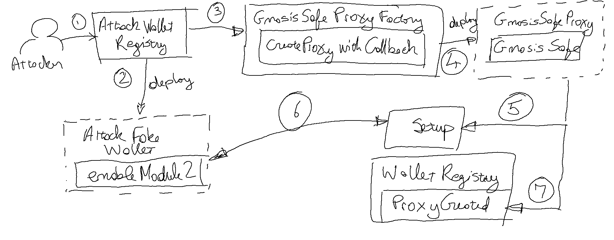

# Solution

* The fundamental CTF vulnerability arises from the assumption that a Safe Wallet is only accessible by its owner.

* `WalletRegistry` ignores that a malicious deployer may install a `Module` that bypasses the contract owner, allowing it to steal its holdings.

* The attack involves two malicious contracts:

    `AttackFakeWallet` - This extends `GnosisSafe` adding `enableModule2` function. The function allows installing a malicious module on safe wallets.

    `AttackWalletRegistry` - A contract that packages all the attacker's operations in a single transaction, satisfying a CTF requirement.

* The attack goes like this:

    1. Player deploys `AttackWalletRegistry`

    1. `AttackWalletRegistry` deploys `AttackFakeWallet`, to be used later.

    1. `AttackWalletRegistry` installs four wallets using `GnosisSafeProxyFactory` | `createProxyWithCallback`

    1. `createProxyWithCallback` is passed a parameter such that once the wallet proxy `GnosisSafeProxy` is deployed it also invokes the `GnosisSafe` | `setup` initialization function.

    1. In turn `setup` allows executing another function through `delegatecall`. This means that `setup` may execute any malicious code we choose. We exploit this by running `AttackFakeWallet` | `enableModule2`. However, because of `delegatecall`, `enableModule2` modifies the state of the safe wallet just deployed, not that of `AttackFakeWallet`.

    1. Through `enableModule2`, `AttackWalletRegistry` configures itself as a module for the wallet just deployed. This gives `AttackWalletRegistry` the right to run any function as the wallet, without needing the wallet owner signatures.

    1. The deployment completes with a call from `createProxyWithCallback` to the `WalletRegistry` | `proxyCreated` callback. This donates 10 DVT tokens to the wallet just deployed.

    1. On completing the deployment, `AttackWalletRegistry` uses its previliged role as a wallet module and calls the DVT token contract to transfer the 10 DVT tokens from the safe wallet to the player.

The following depicts the contract deployment flow:

## Notes

* [Gnosis Safe](https://docs.safe.global/home/what-is-safe)

* This CTF makes use of the Gnosis Safe wallets and we need to be aware of these Gnosis Safe contracts:  
    __GnosisSafe__ - Provides the implementation of a multi-signature wallet.

    __GnosisSafeProxy__ -  Accesses `GnosisSafe` through a proxy, separating storage from implementation. A user deploying a new proxy, gets his own wallet instance as the proxy provides unique storage. This contract simply implements a fallback that forwards all calls to the implementation contract.

    __GnosisSafeProxyFactory__ -  A factory for spawning `GnosisSafeProxy` instances i.e. user specific wallets. This contract exposes `createProxyWithCallback` which deploys a new `GnosisSafeProxy` and calls back a function on the CTF registry contract `WalletRegistry`.

* This CTF requires a good understanding of how Safe wallets are deployed and how we can install a malicious module that allows us to steal tokens from the "safe" wallet.
